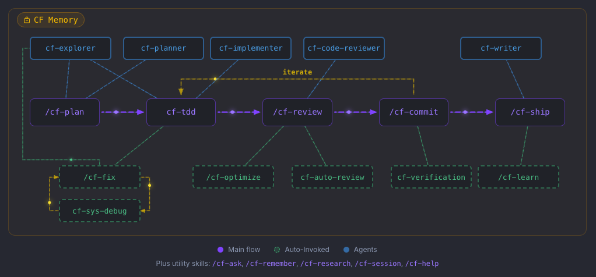
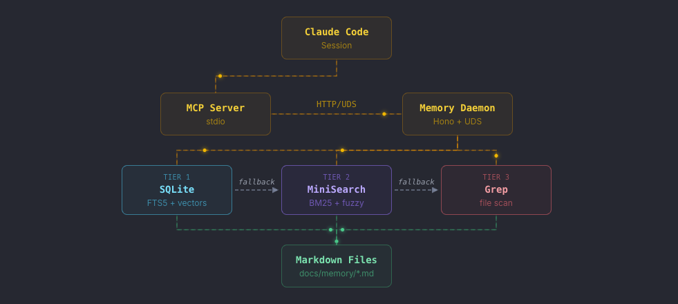
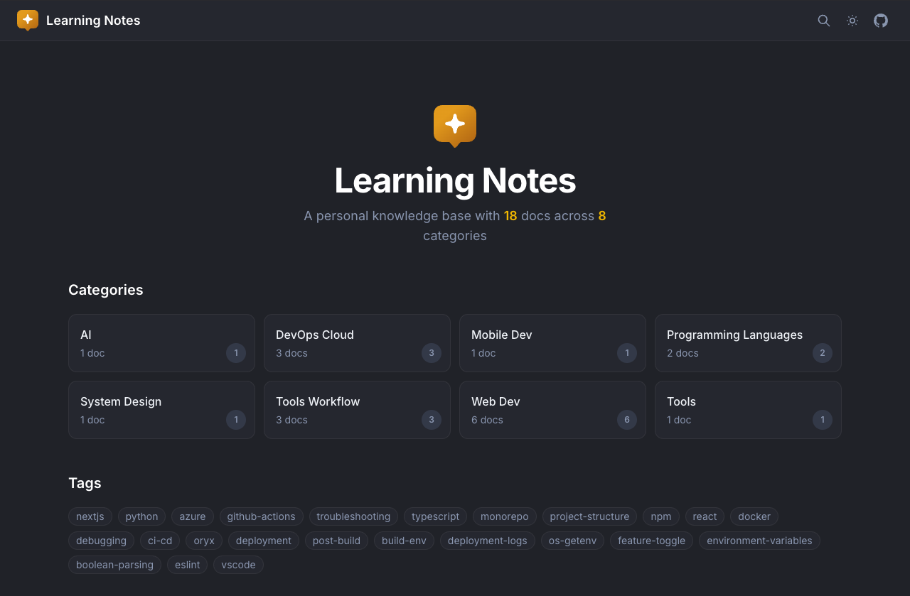

<p align="center">
  
</p>

<h1 align="center">Coding Friend</h1>

<p align="center">
  Lean toolkit for disciplined engineering workflows with Claude Code.
</p>

<p align="center">
  <a href="https://cf.dinhanhthi.com">Website</a> ·
  <a href="https://cf.dinhanhthi.com/docs">Documentation</a> ·
  <a href="https://cf.dinhanhthi.com/changelog">Changelog</a> ·
  <a href="https://github.com/dinhanhthi/coding-friend/issues">Report Bug</a>
</p>

> [!WARNING]
> This repository is in heavy development, use at your own risk.

## What It Does

- Enforces test-driven development (TDD)
- Provides systematic debugging methodology
- Quick bug fix workflow (`/cf-fix`)
- Structured optimization with before/after measurement (`/cf-optimize`)
- Quick Q&A about codebase with memory (`/cf-ask`)
- Ensures verification before claiming done
- Smart conventional commits and code review
- ✨ Cross-agent code review (`/cf-review-out` + `/cf-review-in`) — generate a review prompt for any AI agent (Gemini, Codex, ChatGPT, or human), collect results when ready
- Captures project knowledge across sessions (`/cf-remember`)
- ✨ Persistent AI memory with 3-tier hybrid search (`cf memory`) — stores facts, preferences, debug episodes across sessions with automatic recall
- ✨ Helps humans learn from vibe coding sessions (`/cf-learn`) — browse as a searchable website (`cf host`) or share with other LLM clients via MCP server (`cf mcp`)
- In-depth research with web search and parallel subagents (`/cf-research`)
- Custom skill guides — extend built-in skills with your own Before/Rules/After per skill
- ✨ Save and load Claude Code session chats across machines and accounts (`/cf-session`)
- ✨ Smart auto-approve — two-tier hook (rules + Sonnet LLM) auto-approves safe tool calls, blocks destructive ones, and only prompts when it matters. Available to all users, opt-in via config
- Prompt injection defense — layered content isolation protects against malicious instructions
- CLI utilities — manage plugin installation, project setup, and updates with a single `cf` command. `cf permission` lets you interactively configure Claude Code's tool permissions
- ✨ Customizable Claude Code statusline with account info & API rate limit tracking
  ```
  cf v0.3.0 | 📂 MyProject (⎇ main) | 🧠 Opus (1M)
  👤 Thi Dinh (me@dinhanhthi.com)
  ctx 42% | [5h] 30% → 2:30pm | [7d] 10% → mar 15, 2:30pm
  ```

For full details, visit the **[official website](https://cf.dinhanhthi.com/#features)**.

## How it works

Main workflow:

<p align="center">
  
</p>

Memory architecture (read more about it [here](https://cf.dinhanhthi.com/docs/reference/memory-system/)):

<p align="center">
  
</p>

The Learning Notes taken from your coding sessions with the help of the `/cf-learn` skill and `cf host` command:

<p align="center">
  
</p>

## Quick Start

### Option A: One-Prompt Install

Already have [Claude Code](https://claude.com/claude-code) running? Paste this prompt and Claude will handle the rest:

```text
Install the "coding-friend-cli" npm package globally and set up the Coding Friend
plugin for Claude Code. Follow these steps in order, checking each one before
moving to the next:

1. Check that Node.js >= 20 is installed (run: `node -v`). If not, stop and tell
   me to install Node.js 20+ first.
2. Install the CLI globally (run: `npm i -g coding-friend-cli`).
3. Verify it works (run: `cf --version`). Show me the version.
4. Install the plugin (run: `cf install --user`).
5. Initialize the workspace in the current project (run: `cf init`). When cf init
   asks questions, explain each option to me and let me choose.
6. Show a short summary of what was installed and remind me to restart Claude
   Code to load the plugin.
```

After the install, restart Claude Code (or run `/exit` then reopen) to load the plugin.

### Option B: Manual Install

Requires [Node.js](https://nodejs.org/) 20+ and [Claude Code](https://claude.com/claude-code).

```bash
# 1. Install the CLI
npm i -g coding-friend-cli

# 2. Install the plugin
cf install

# 3. Initialize your workspace
cf init

# 4. Restart Claude Code
```

### 5. Enable AI memory (optional)

The memory system stores project knowledge (facts, conventions, debug episodes) and recalls them automatically in future sessions. Basic memory works immediately, but you can enable better search:

```bash
cf memory start-daemon  # Start daemon with fuzzy search (Tier 2)
cf memory init       # Initialize SQLite with hybrid search (Tier 1)
cf memory status     # Check current tier and document count
```

Then bootstrap memory with project knowledge inside Claude Code:

```
/cf-scan This is a Next.js app with PostgreSQL and Stripe
```

This scans your project and creates ~10-15 memories covering architecture, conventions, and key features. Safe to run multiple times.

Learn more: [cf memory](cli/README.md#cf-memory), [Memory System](https://cf.dinhanhthi.com/docs/reference/memory-system/).

### 6. Host your learning docs (optional)

The `/cf-learn` skill generates learning notes from your coding sessions. You can browse them as a website or expose them to other LLM clients:

```bash
cf host              # Serve docs/learn/ as a website at localhost:3333
cf mcp               # Setup an MCP server so other LLM clients can read your notes
```

Learn more: [cf host](cli/lib/learn-host/README.md), [cf mcp](cli/lib/learn-mcp/README.md).

## Commands

| Command                 | Description                                 |
| ----------------------- | ------------------------------------------- |
| `/cf-plan [task]`       | Brainstorm and write implementation plan    |
| `/cf-fix [bug]`         | Quick bug fix workflow                      |
| `/cf-ask [question]`    | Quick Q&A about codebase                    |
| `/cf-optimize [target]` | Structured optimization with measurement    |
| `/cf-scan [desc]`       | Scan project and bootstrap memory           |
| `/cf-review [target]`   | Code review in forked subagent              |
| `/cf-commit [hint]`     | Analyze diff and create conventional commit |
| `/cf-ship [hint]`       | Verify, commit, push, and create PR         |
| `/cf-session`           | Save/load Claude Code sessions              |
| `/cf-remember [topic]`  | Capture project knowledge                   |
| `/cf-learn [topic]`     | Extract learnings for human review          |
| `/cf-research [topic]`  | In-depth research with web search           |
| `/cf-help [question]`   | Answer questions about Coding Friend        |

Auto-invoked skills (no slash needed): `cf-tdd`, `cf-sys-debug`, `cf-verification`.

## CLI Commands

The plugin is managed by the CLI `cf` command. Learn more about the CLI in the [CLI documentation](cli/README.md).

## Evaluation

We run controlled A/B tests to measure whether Coding Friend actually improves Claude Code's output. Scores are not listed here because skills change frequently and published numbers would quickly become stale. To see the methodology and run the evals yourself, check [evals/README.md](evals/README.md).

## Plugin development

For plugin developers, check [plugin-dev.md](docs/plugin-dev.md).

## Further Reading

Read the [official documentation](https://cf.dinhanhthi.com).

## License

MIT
