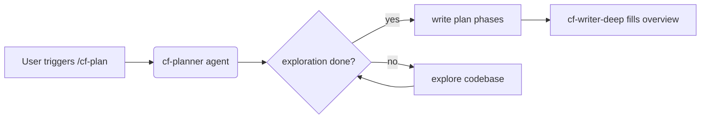

<!-- cf-plan human overview template (markdown). cf-writer-deep fills the FILL markers from the agent plan. Keep it concise and decision-focused; no step-by-step task lists. -->

# {Plan name}

<!-- FILL: plan name, e.g. "Add streaming support to cf-review" -->

## Problem & Intent

<!-- FILL: the original problem / intention / purpose, 2-4 concise sentences -->

## Solution (Big Picture)

<!-- FILL: what we're going to do, high level, no step-by-step TODOs -->

## Key Decisions

<!-- FILL: the main decisions the plan makes, one concise line each -->

- Decision one: short phrase that captures the choice made.
- Decision two: another choice and brief rationale if non-obvious.
- Decision three: a third example decision.

## Diagrams

<!-- FILL: Mermaid diagram(s) for structure / flow / state machine / algorithm where a picture beats prose -->

## Not Building

<!-- FILL: explicit out-of-scope items -->

- Out-of-scope item one.
- Out-of-scope item two.
- Out-of-scope item three.
